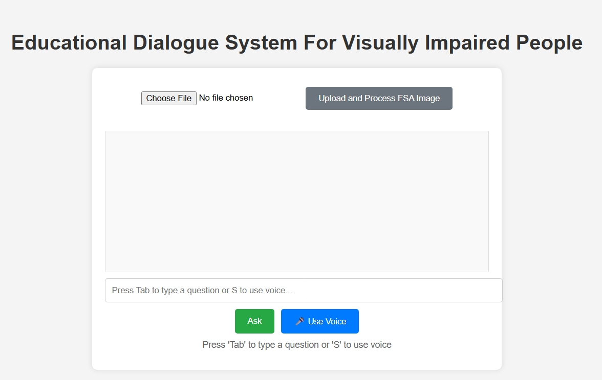
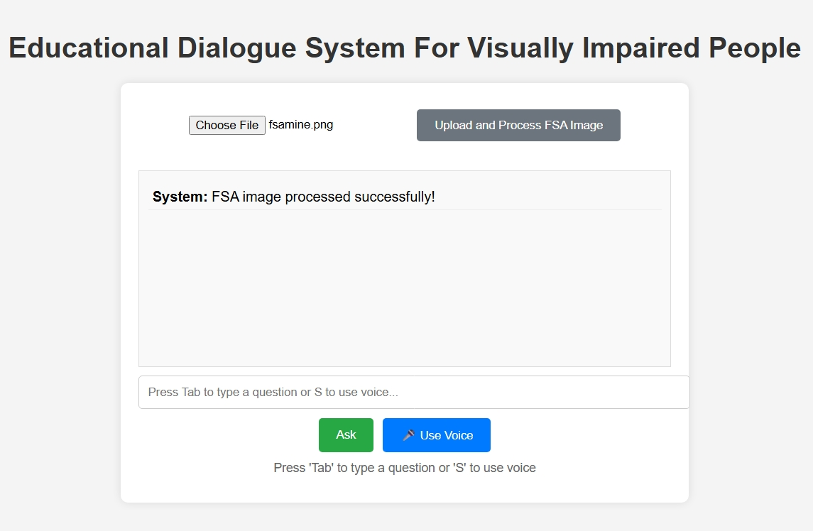
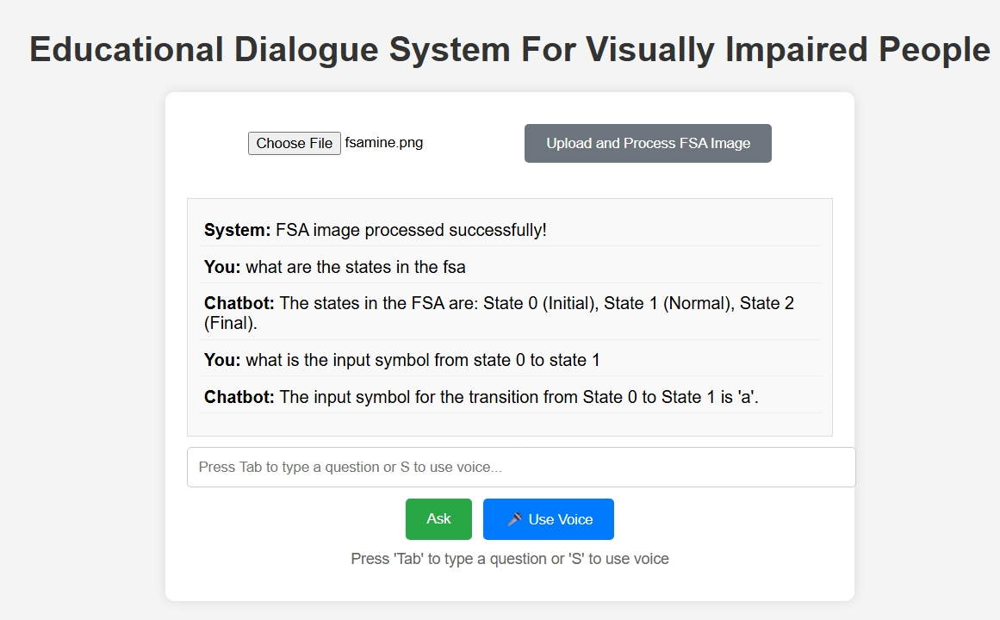
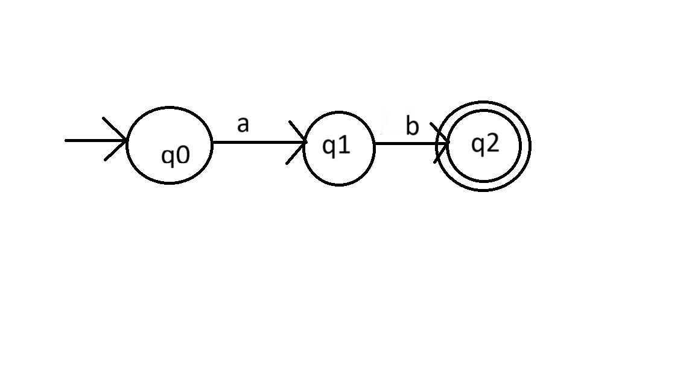
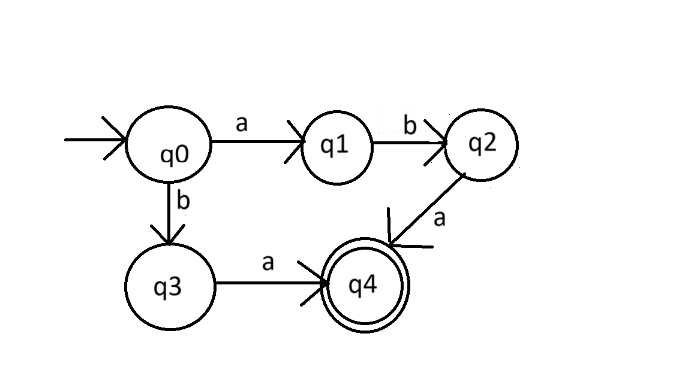

#  Voice-Enabled FSA Bot

An educational chatbot designed to assist visually impaired individuals in understanding **Finite State Automata (FSA)** using voice and text interaction.

---
##  Demo

###  Home Page


###  Processing Image


###  User Queries


## Problem Statement
To develop an educational dialogue system for visually impaired individuals to enhance their understanding of Finite State Automata (FSA), improving accessibility, efficiency, and comprehension while minimizing cognitive load and navigation difficulties associated with traditional graphical representations.

## Solution
- The system provides an intelligent image recognition and voice-based interaction tool for understanding finite automata.
- Designed to assist visually impaired individuals in comprehending finite state automata.
- Uses a combination of image processing, rule-based query handling, and text-to-speech (TTS) technologies.

   
##  Features

-  Image upload of FSAs (Finite State Automata)
-  Image processing using **OpenCV** and **Tesseract OCR**
-  Rule-based chatbot for answering FSA-related queries
-  Voice input using the `speech_recognition` module
-  Voice + text output using `pyttsx3` (text-to-speech)
-  Simple and accessible web interface (HTML, CSS, JavaScript)
-  Backend built with **Flask** and **Python**

---

##  How It Works

1. The user uploads an image of a Finite State Automaton (hand-drawn or computer-generated).
2. The image is processed using **OpenCV** and **Tesseract OCR** to extract text and graphical structures.
3. Based on this information, the chatbot constructs a **transition table** of the FSA.
4. The user can then ask queries like:
   - “What are the states in the FSA?”
   - “What are the transitions in the FSA?”
   - “What is the initial/final state?”
   - “Input symbol from state A to B?”
5. Queries can be typed or spoken using the voice button.
6. The bot responds in both **text** and **voice** for accessibility.

---
### Sample FSA 1


### Sample FSA 2


##  Requirements

Install dependencies using:

```bash
pip install opencv-python pytesseract flask pyttsx3 speechrecognition pyaudio
```
---

##  How to Run

```bash
python app.py
```

Then open your browser and go to:
http://127.0.0.1:5000/

To stop the app, press Ctrl + C in the terminal.

##  Steps to Use
1. Click Choose File to select an image of a Finite State Automaton (FSA), then click Upload and Process FSA Image.
2. Press Tab to focus on the input box and type your question, or press S to activate voice input.
3. You can also use the "ASK" button to submit your typed question or "USE VOICE" to speak your query.

##  Notes
1. Avoid cluttered or low-resolution FSA diagrams.
2. Wait for the voice message-"Please ask your question now" before asking your question.

## Result
The developed educational dialogue system successfully enables visually impaired individuals
 to interactively learn and comprehend Finite State Automata (FSA) through voice-based queries
 and responses, eliminating reliance on graphical representations while enhancing accessibility  
 and understanding.

## Relevance
- Enhancing Accessibility in STEM Education
- Remote and Self-Paced Learning
- Reducing Cognitive Load in Learning
- Support for Digital Inclusion Initiatives
- Voice-Based Interaction Eliminates Visual Dependency

##  Future Enhancements
1. Support for non-deterministic FSAs and ε-transitions
2. Ability to handle more complex automata like Pushdown Automata (PDA) and Turing Machines
3. Integration with string acceptance checking to simulate input strings
4. Use for other graphical structures beyond FSAs
5.Improved OCR accuracy and error correction

## References
[1 ]P. F. Balestrucci, E. Di Nuovo, M. Sanguinetti, L. Anselma, C. Bernareggi and A. Mazzei,
      "An Educational Dialogue System for Visually Impaired People," in IEEE Access, vol. 12, pp. 
      150502-150519, 2024, doi: 10.1109/ACCESS.2024.3479883.

[2] https://docs.opencv.org/3.4/d9/db0/tutorial_hough_lines.html

[3] https://pypi.org/project/pyttsx3/

[4] https://www.researchgate.net/publication/2385075_Rule-Based_Dialogue_Management_Systems


##  Co-creators
- [Anna Irene Ditto](https://github.com/anna-irene)  
- [Anna Keerthana V](https://github.com/annakv04/)
- [Cristal James Tomy](https://github.com/CristalJamesTomy/)
